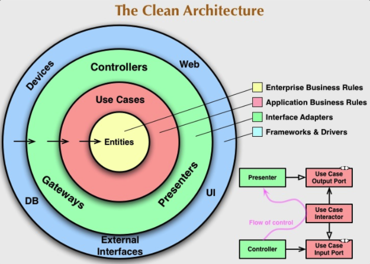

### Sobre o Aplicativo
> **_Construido para um Challenge da Empresa [Bloxs](https://www.bing.com/search?q=bloxs+investimentos&cvid=bd608123123d47b0b9b4dc093c006bb6&aqs=edge.1.69i57j0l2.3575j0j1&pglt=299&FORM=ANNTA1&PC=U531)_**
<div style="display: flex;">
</img>

</div>

### Como Rodar o  Aplicativo

- yarn
- [***IOS***]
  - cd ios && pod install
  - yarn ios
- [***ANDROID***]
  - yarn android


### Sobre a arquitetura do Aplicativo

> **_Foi utilizado a Clean Architecture_**

- [Referencia para Leitura](https://medium.com/luizalabs/descomplicando-a-clean-architecture-cf4dfc4a1ac6)
  <br>
  <br>
  </img>

## Diretórios

```
src/
  data/
    models/
    protocols/
    usecases/
  domain/
    errors/
    models/
    usecases/
  infra/
    cache/
    http/
  main/
    adapters/
    builders/
    composites/
    config/
    decorators/
    factories/
    proxies/
    routes/
  presentation/
    components/
    hooks/
    pages/
    protocols/
    styles/
  validation/
    errors/
    protocols/
    validators/
```

